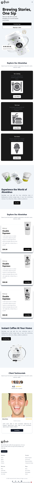

# ☕ Alowishus Coffee Landing Page

-A modern, responsive landing page for a coffee shop built with React, Vite, Tailwind CSS, and AOS (Animate On Scroll).
-The project features smooth scroll animations, a fully responsive layout, carousel sections, a multi-column footer, and a fixed developer badge.

---

## 📌 Features

-⚡ React + Vite for fast performance and hot-reloading

-🎨 Tailwind CSS for utility-first styling

-✨ AOS animations for smooth scroll effects

-📱 Fully responsive layout for mobile, tablet, and desktop

-🖼 Carousel section with text + image columns

-🦶 Multi-column footer with social icons and navigation links

-❤️ Fixed “Designed & Developed by Hammad Ashraf ❤️” badge

-🔥 Smooth hover, click, and active state animations on buttons

-🖼 Custom favicon support (.png recommended)

---

## 🖼️ Screenshots

# 📂 Project Structure

src/
├── assets/ # Images and assets
├── components/
│ ├── Carousel/
│ ├── Footer/
│ ├── Header/
│ └── Sections/
├── App.jsx
├── main.jsx
└── index.css # Tailwind CSS + global styles
public/
├── favicon.png # Website favicon
└── index.html

---
